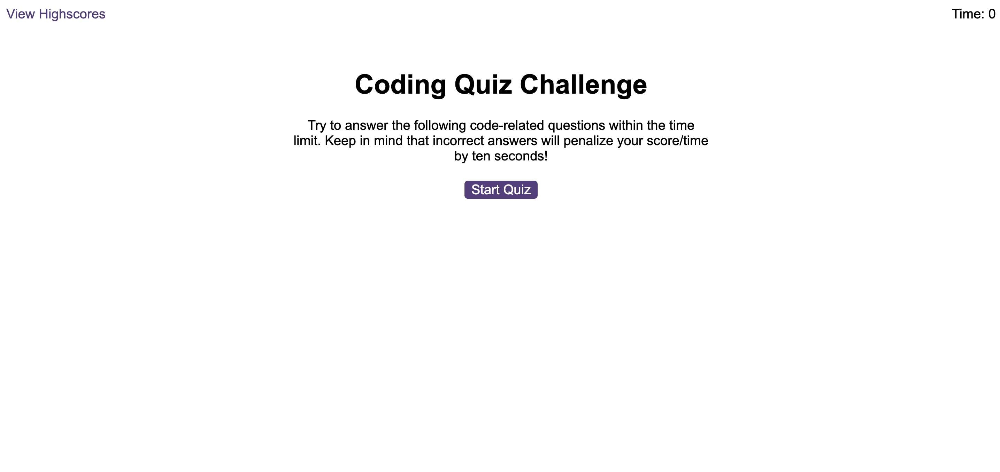
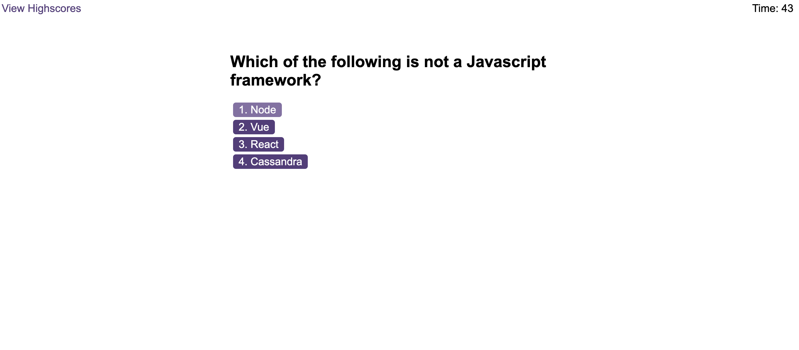
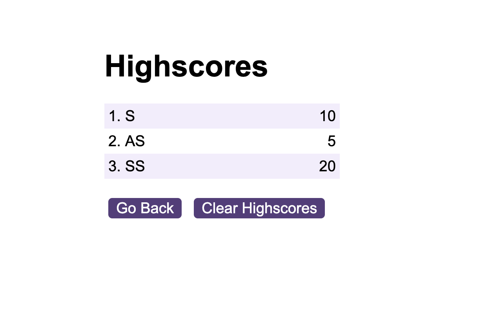

# Timed Code Quiz
A timed code quiz on javascript fundamentals

## Description

The aim of this project was to create an application for javascript students to take a timed quiz on javascript coding basics and save highscores so taht they can assess their progress.\
Code was written in javascript using the knowledge of manipulating the DOM through javascript The application features dynamically updated HTML and CSS handled through javascript.

Version control was through git and the updated repository can be found at:

https://github.com/ShaliniSunkuru/timed-code-quiz-js  

## Table of Contents

- [User Story](#user-story)
- [Acceptance Critera](#acceptance-criteria)
- [Screenshot](#screenshot)
- [Technology Used](#technology-used)
- [Deployment](#deployment)
- [Usage](#usage)
- [Credits](#credits)
- [License](#license)

## User Story

AS a coding student\
I WANT to take a timed coding quiz on javascript basics and save highcores\
SO THAT I can assess my progress

## Acceptance Criteria

GIVEN an application to take a quiz\
WHEN I open the application in the browser\
I see some instructions and a start button\
WHEN I click on the Start button\
The timer that shows 75 seconds starts decrementing\ 
And The first multiple choice question is displayed with buttons for each answer\
WHEN I click on an answer button\
I am shown whether it is Correct/Wrong\
And a sound is played based on whether the answer is correct or worng.\
The next question is displayed.\
WHEN I click on a wrong answer\
10 seconds is deducted from the timer\
WHEN I answer all questions or the timer runs out\
The quiz ends and my score is shown\
I also see a form to submit my initials to save the score\
WHEN I type in my initials\
I am alterted if the length is invalid\
If my input is accepted, \
My scores are stored and I can see a list of highscores.\
WHEN I click on the CLear Highscores button\
All highcores are cleared.

## Screenshot

Here are some screenshots of the application at various stages of the quiz.

## Technology Used

The following tools and technologies were used in this project

- HTML5
- CSS
- Javascript
- Visual Studio Code
- GIT
- Github
  
## Deployment

Here is a link to the deployed project.

https://shalinisunkuru.github.io/timed-code-quiz-js/ 

## Usage

Click on the url for the deployed project.\ 
Click on the Start Quiz button to start the quiz.\
Click on an answer button for every question.\
Notice the timer, and notifications for correct/wrong answers.\
Save your score\
View/clear highscores\

## Credits

I appreciate the guidance of the instrutor and TAs of edX Bootcamp for making it fun to learn the new concepts of DOM manipulation including event handling using javascript. W3Schools, and stack overflow have been a great help in grasping the concepts of javascript. 

## License

Please refer to the MIT License in the repository.

